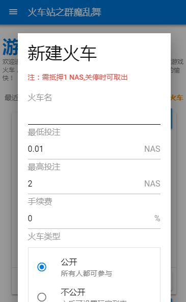

#  火车站之群魔乱舞——游戏大厅

------

开火车是搭载在星云链上的一款扑克卡牌游戏，有的地方也叫接竹竿。具体玩法是，每个人都可以摸一张牌，同时附加一定的NAS，金额不得低于上一人。系统发票后，如果当前牌跟扑克队列里的某张牌具有相同的数字，那么这两个牌之间的所有牌都归你，其附带的NAS也全部变成你的了！

欢迎进入《火车站之群魔乱舞》游戏大厅，在这里你可以新建游戏火车，也可以加入到朋友的火车中，和他们一起游戏！

------

## 教程

###  需要的软件

想要使用开火车的完整功能，需要使用星云钱包使用区块链写入功能。 

推荐使用手机访问dAPP，可使用移动版Chrome等浏览器，并安装星云官方移动钱包 [NAS nano](https://nano.nebulas.io/index.html)。

对于电脑用户，推荐使用谷歌浏览器，并安装 [星云官方钱包插件](https://github.com/ChengOrangeJu/WebExtensionWallet) ，然后打开插件，新建钱包，保存keystore文件并载入到插件中。

> 注意：如果不使用钱包，仅可进行围观，无法参与其中
 若使用钱包，请保证包含一定的NAS（几毛钱即可）用做GAS手续费。如果无手续费，请参与官方的[推荐激励](https://incentive.nebulas.io/cn/signup.html?invite=reOoc)活动，即可获得随机空投。

### 图示

</img> 

</img> 

</img> 

</img> 

